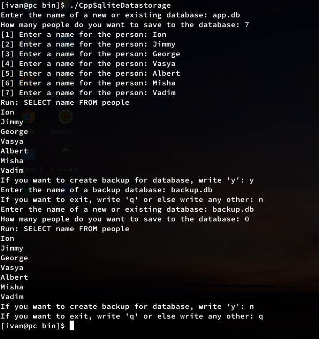
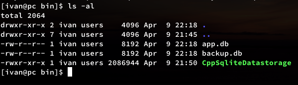

# Simple sqlite c++ wrapper


## Build:

```
$ cmake -E make_directory build
$ cmake -E chdir build cmake .. -Dtest=ON -DCMAKE_BUILD_TYPE=Debug
$ cmake --build build
$ # RunTests: cmake -E chdir build ctest --verbose

```


## Screens:



